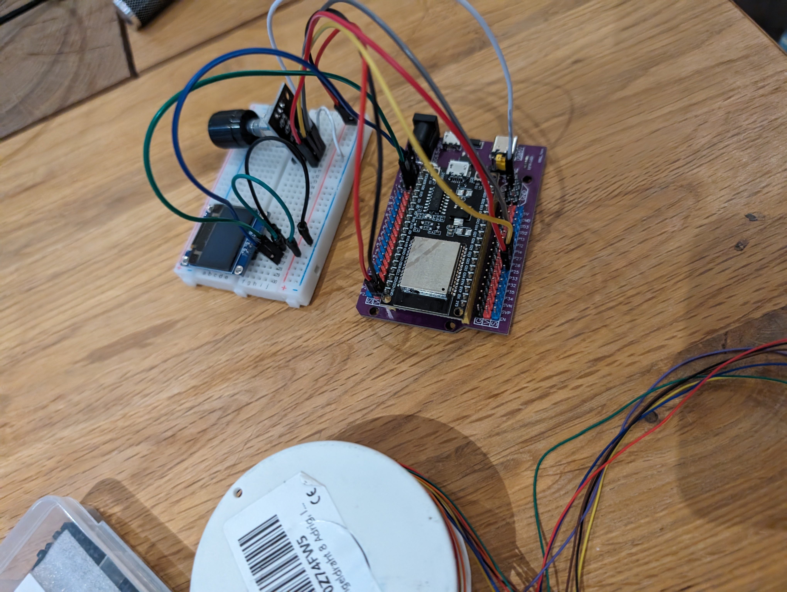

# Project Title

Project created in course of the "Girls‘Day – Mädchen-Zukunftstag"

https://www.bafza.de/engagement-und-aktionen/girlsday-und-boysday

## Description

Project goals was to setup a device which will be used to  set a timer to shut down lights in the dormitory.

## Getting Started

### Dependencies

#### hardware / environment
  * somewhat "triggerable" light-switch (in our case: KNX based lighting with a KNX-IP-Tunnel-Interface "controlled" by node-red)
  * esp32
  * sh1106-display or ssd1306-display
  * rotary encoder KY-044
  * wiring / breadboard / soldering iron. We ended up wrap-wiring the connections because it was safer and the day was over quite fast.
  * not needed, but somewhat "good": printed 3d-case. We ended up using [this](https://www.printables.com/de/model/94864-esp32-project-enclosure-with-oled-ssd1306-096) one 
    and just physically enlarging the hole with a step drill to make enough room for the KY-044 rotary encoder.
  * rotary-encoder


#### software / environment
  * wifi 
  * installed mqtt-server (we used a local mosquitto instance for that purpose)
  * installed node-red (used to bridge mqtt to knx) so that we can just send a mqtt-msg and node-red sends the appropriate knx-datagram to shut down the light
  * not needed, but we were quite happy to use thonny for copying over files and reworking some parts of the code

### Installing

* install a fresh version of micropython on an esp32 with wifi capabilities 
* copy over all files found in this repo to the device
* either adapt esp32config.json or create a copy of esp32config.json named as esp32config.local.json and adapt settings therein such as:
  * wifi-networks credentials
  * mqtt-broker credentials
  * enable i2c and set pins appropriately
  * enable rotary and set pins appropriately
  * create logic (e.g. via node-red) which listens to the "lightswitchfeed"-topic on the mqtt-broker and if data comes in triggers the light accordingly

### Executing program

* since the code is placed in boot.py and main.py just booting/resetting the esp32 should make this work
* Step-by-step bullets

## Authors

Contributors names and contact info

* This repo's owner
* Other people mentioned/credited in the files

## Version History

* -0.42
    * the will be no versioning.

## License

This project is licensed under the LGPL where applicable/possible License - see the [LICENSE.md](LICENSE.md) file for details

## Acknowledgments

Inspiration, code snippets, etc.
* please see comments in files for that


## some pictures of it
[](media/53678932185_17f35cdcf2_o_noexif.jpg)
[](media/53678474571_7016aef8c0_o_noexif.jpg)<br/>
[](media/53677607202_37d839e11e_o_noexif.jpg)
[](media/53678942538_5d5f78f434_o_noexif.jpg)<br/>

[media/53679181530_512f8441dc_vm_noexif.mp4](media/53679181530_512f8441dc_vm_noexif.mp4)<br/>

#### btw. removing exif-data from jpg-files is quite easy
* ```for i in *jpg ; do exif -o ${i%.jpg}_noexif.jpg --remove $i ; done```

#### to find a solution for properly removing exif-data from mp4-files was quite an ordeal
* ```ffmpeg -i 53679181530_512f8441dc_vm.mp4 -map_metadata -1 -vcodec copy -an 53679181530_512f8441dc_vm_noexif.mp4```
* or even as webm:<br/>```ffmpeg -i 53679181530_512f8441dc_vm.mp4 -crf 40 -deadline best -vf scale=2040:-2 -an -map_metadata -1 -an 53679181530_512f8441dc_vm_noexif.webm```<br/>
which has then to be renamed to .mp4 since it would not "play" otherwise ?! Giving up on video-embed in this file now...

